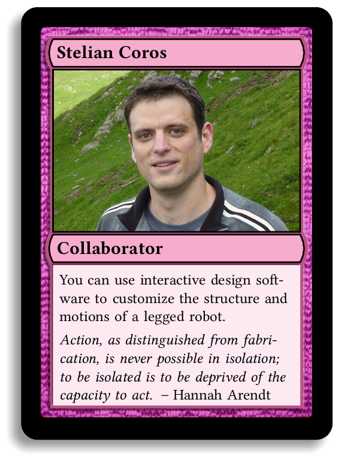
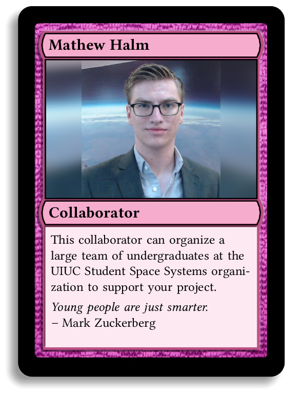
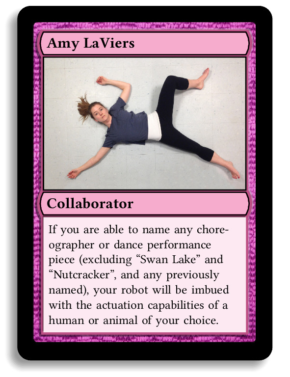
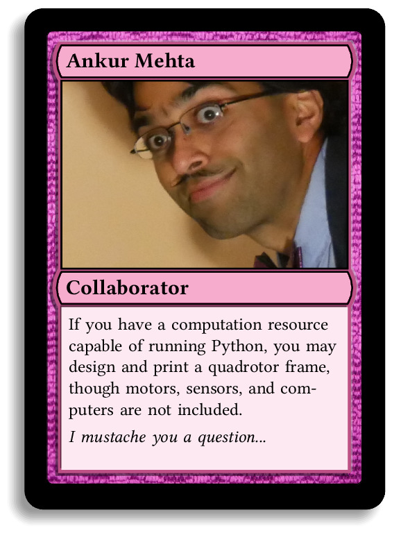
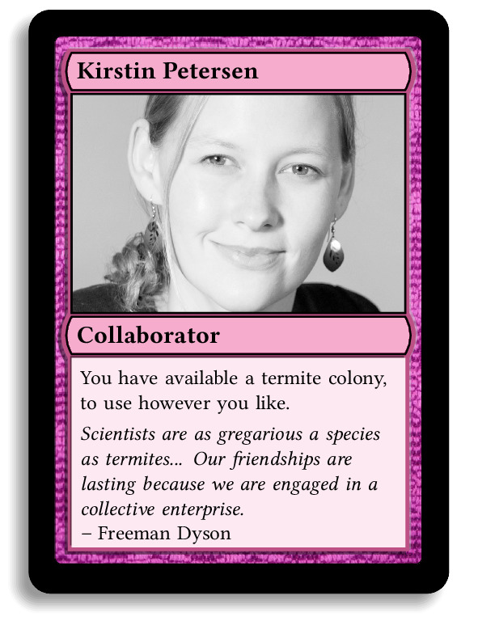
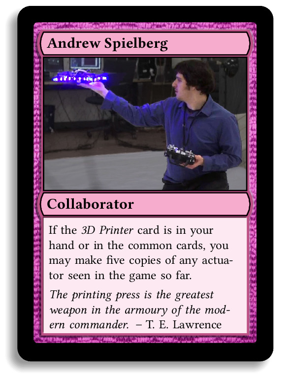
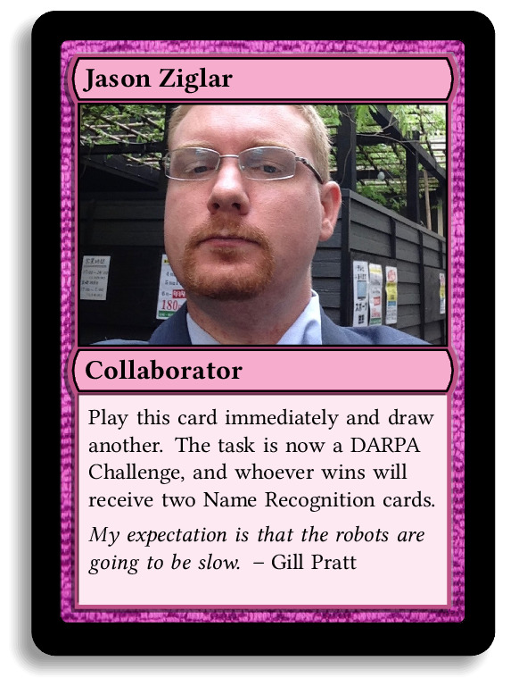

---
css: stylesheets/minimal-css.css
# title: Minimality and Trade-offs in Automated Robot Design
header-includes:
    - <meta http-equiv="X-UA-Compatible" content="chrome=1">
    - <meta name="google-site-verification" content="5mklLA9upjJM1mkMEk0-Yk6PoEsTu5dH_BbPWdxTieM" />
...

<video width="320" height="400" autoplay>
<source src="deck.mp4" type="video/mp4">

</video>

<h1>RSS 2017 Workshop on Minimality and Trade-offs in Automated Robot Design</h1>

We are excited to invite you to the
[RSS 2017][rss17] workshop on *Minimality and Trade-offs in Automated Robot Design*, a full day workshop, on Sunday, July 16.

[rss17]: http://www.roboticsconference.org

This workshop follows the successful [first edition in 2016][ws16].
That is the workshop that originated [The Robot Design Game][RDG],
a **card game** which seeks to explore the tradeoffs in resource
constraints inherent in robot design problems. This year, we have an
improved workshop format, and improved game as well!

This is a special workshop, for many reasons. Rather than making it a
"mini conference" on a narrow established topic, which is the current
mainstream idea of what a "workshop" should be, we sought to make this
an opportunity to think broadly about some new interesting science to
come.

The workshop is divided in three parts:

* **Short Talks**:
  During the morning session, there is a sequence
  of short talks about the [guiding questions of the workshop][qs].
  The presenters were selected based on their preliminary
  statements. This allowed us to have a very diverse range of backgrounds - from students to professors.
  You can read the [preliminary statements in this Google Doc][statements].

* **Robot Design Game tournament**:
  During the third session (first half of the afternoon), it's
  play time! We will play the [Robot Design Game][RDG].
  **We will gift 8 copies of the game** to the winners of the tournament.

Please contact us if you already know how to play the game and want
  to be an "associate editor" in the tournament.

* **Break up groups**:
  During the fourth session (second half of the afternoon),
  we will break into groups. Each group will think about one specific
  question or topic inspired by the morning talks, and then, later
  we will report back.

Please contact us if you wish to be a group leader for this part.

Later the organizers will edit the materials produced into a position statement.

Date/Location
-------------

-   Sunday, July 16 (full day workshop)

<!-- -   location TBA -->

Schedule
--------

Time                Speaker/Activity
----                ----------------
**9:30-9:45**       Andrea Censi - *Introduction to the workshop*
**9:45-10:00**      [Ankhur Mehta](https://uclalemur.com/)
**10:00-10:15**     [Andrew Spielberg](http://www.andrewspielberg.com/)
**10:15-10:30**     [Amy LaViers](http://radlab.mechse.illinois.edu/)
**10:30-11:00**     *Break*
**11:00-11:15**     [Stelian Coros](http://www.cs.cmu.edu/~scoros/)
**11:15-11:30**     [Sehoon Ha](http://sehoonha.com/)
**11:30-11:45**     Mathew Halm
**11:45-12:00**     Jason Ziglar
**12:00-12:15**     [Kirstin Petersen](http://cei.ece.cornell.edu/)
**12:30-1:30**      *Lunch*
**1:30-2:00**       Reconvene from lunch, form groups for the [Robot Design Game][RDG]
**2:00-3:00**       Alli Nilles - Explanation of the [Robot Design Game][RDG], followed by the game tournament
**3:00-3:30**       *Break (or continue playing the game)*
**3:30-4:00**       Hadas Kress-Gazit, *Group Discussion and Planning Next Steps*
**4:00-4:45**       *Breakout discussions*
**4:45-5:30**       *Report and discuss breakout discussions*

The discussions will be moderated by Jason O'Kane.

Workshop motivation
--------------------

Most fields of engineering are characterized by fundamental trade-offs between
maximizing performance and minimizing resource usage; robotics is no exception.
In robot design, trade-offs are distributed among subsystems such as sensing,
actuation, computation, and power. A mathematical framework to describe these
trade-offs does not yet exist.

The speakers and discussions in this workshop will focus on working toward
formal representations that make automated reasoning and synthesis possible, and
enable design choices beyond once-off, ad hoc solutions.

The workshop brings together roboticists with a variety of backgrounds to start
to answer the question:

> "How can computers and software help us navigate the space of design
> decisions?"

The workshop includes both invited speakers and a call for presenters who:

(1) can share practical examples of resource-constrained robots and their
performance envelopes;

(2) are exploring abstractions and models which have promise as foundations for
algorithmic design;

(3) have novel and unconventional ideas for how to tame the computational
complexities involved.

The intended outcome of the workshop is a better understanding of how informal
design decisions, including those exemplified in a custom design card game —
played and discussed after lunch — can be refined and systematized so as to
become fit for automation.

### Guiding questions for the workshop {#qs}

*See [here for the preliminary statements][statements] written
by the speakers.*

1. What would an ideal automated robot design process look like? What is the role
of human interaction with the tool? What techniques can we use from formal
methods or software engineering and human-computer interaction? The broader
design community? What is there to learn from the "maker" movement?
2. How can we parametrize (or otherwise abstract) robotic components, to avoid
hand-maintaining large component “libraries”? What are the pros and cons of
modular robotic components in automating design?
3. What are examples of robots achieving tasks with minimal resources? How can
these examples inform automatic design?
4. Are sensing, actuation, computation, communication and power the correct
categories for formalizing robotic resources? What are some first steps toward
formalizing resource trade-offs in robot design?
5. What are some interesting existing methods for formal specification of robot
functionality and task structure? What are the shortcomings of these methods?
6. What question is missing from this list?

### Organizers

* [Andrea Censi](http://censi.science) (ETHZ/nuTonomy)
* [Hadas Kress-Gazit](http://verifiablerobotics.com) (Cornell)
* [Alexandra Nilles](http://alexandroid000.github.io/index.html) (UIU
* [Jason O'Kane](https://cse.sc.edu/~jokane) (South Carolina)

Related Materials
-----------------

### Minimality & Design Automation: Workshop at RSS 2016

[See here][ws16] for the predecessor of this workshop at RSS
2016.

### The Robot Design Game

[The Robot Design Game][RDG], **a card game** developed for RSS 2016
which seeks to explore the tradeoffs in resource constraints inherent in robot
design problems.

[ws16]: RSS2016/rss2016.html
[RDG]: http://robot-design.org
[statements]: https://docs.google.com/document/d/1UkeHG5pLoZn7RzAWK64PvMG-sOkHlyZXX92dFjePHUw/edit?usp=sharing
[qs]: #qs
